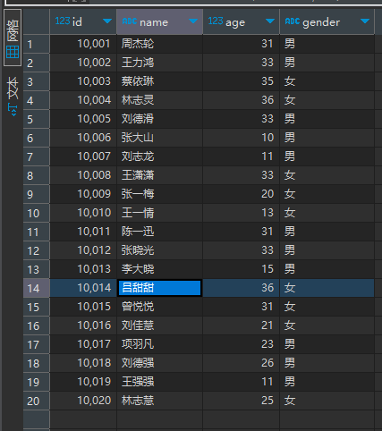
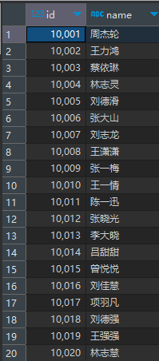
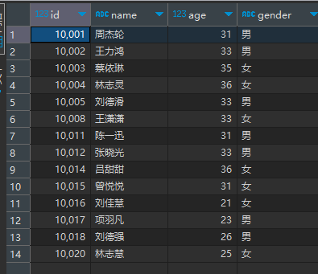
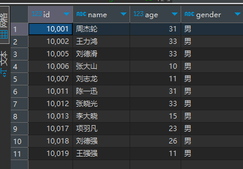
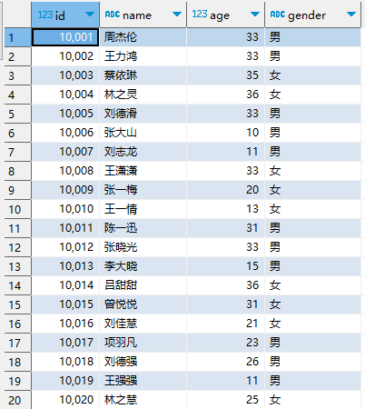
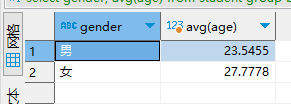
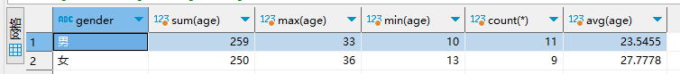

# SQL 基本语法
## 数据查询：DQL (Data Query Language)
**例子——查询整个表中数据:**
```commandline
select * from student;
```
<br>
**查询 指定列**
```commandline
select id, name from student;
```
<br>
**查询 列age 大于 20的数据**
```commandline
select * from student where age > 20;
```
<br>
**查询 列gender 等于 男的数据**
```commandline
select * from student where gender = '男';
```
<br>
## 分组聚合
**语法**
```
select 字段|聚合函数 from 表 [where 条件] group by 列;
```
例子：按照性别gender，统计男、女年龄平均值<br>

```commandline
select gender, avg(age) from student group by gender;
```
输出结果为：<br>
<br>
也可以展示多个聚合
```commandline
select gender,sum(age),max(age),min(age),count(*), avg(age) from student group by gender;
```
输出结果：<br>
<br>