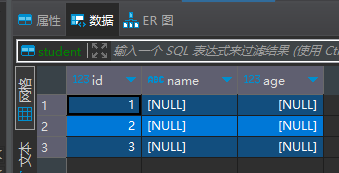
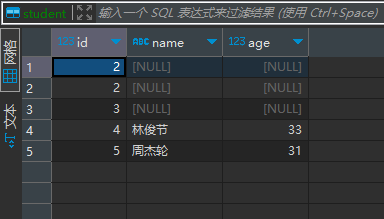
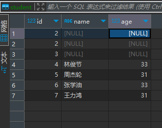
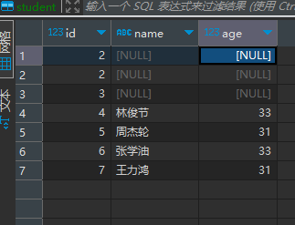
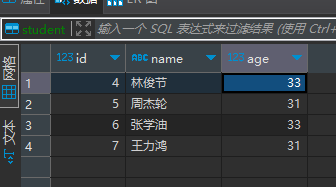
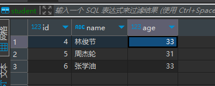
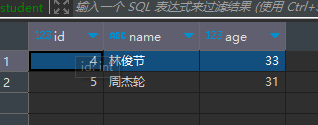
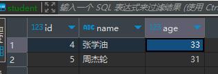
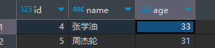
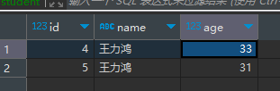

# SQL 基本语法
## 数据操纵：DML (Data Manipulation language)
**插入数据——语法**
```commandline
insert into 表(列1,列2,列3……) values(值1,值2,值3)
```
例:
```commandline
insert into student(id) values(1),(2),(3);
```
---
<br>

---
多列插入1:
```commandline
insert into student(id, name, age) values(4, '林俊节', 33),(5, '周杰轮', 31);
```


多列插入2:
```commandline
insert into student values(5, '张学油', 33),(6, '王力鸿', 31);
```



**删除数据——语法**
```commandline
delete from 表名称 where 判断条件
```
条件判断：列 操作符 值
操作符 `> < = >= <= !=`
**例子** 删除id为1的行
```commandline
delete from student where id = 1;
```


例子 删除id小于4的行
```commandline
delete from student wher id < 4;
```


例子 删除id大于6的行
```commandline
delete from student where id > 6;
```


删除整张表内数据---不填写条件判断
```commandline
delete from setdent;
```
**更新数据--语法**
```commandline
update 表名 set 列 = 值 [where 判断条件]
```
例子:将name列中添加 张学油 到 id=4的地方<br>

```commandline
updata student set name = '张学油' where id = 4;
```


列子:将整张表中所有的name列都改成 王力鸿

```commandline
updata student set name = '王力鸿'
```



